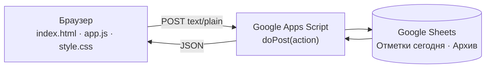

# ⚔️ Управление кланом

Ежедневный трекер активности игрового клана: кто пропустил торг и поход, сколько ключей слил
в лабиринте и кому уже выдано предупреждение.

[](https://kebuzya.github.io/KebuzClanActivity/)
[](https://developers.google.com/apps-script)
[](https://sheets.google.com)


### ➡️ [Открыть приложение](https://kebuzya.github.io/KebuzClanActivity/)

Ни установки, ни регистрации, ни пароля. Открывается в браузере телефона так же, как на компьютере,
и добавляется на домашний экран как обычное приложение.

---

## Что умеет

### Отметки дня

Таблица всех участников с тремя счётчиками пропусков за последние 7 дней: 🛒 торг, 🌀 лабиринт,
🚩 поход. Ячейки подсвечиваются по тяжести, так что проблемные игроки видны сразу.

Правки копятся локально и уходят в таблицу по кнопке «Сохранить». Если засиделись, через 3 минуты
сработает автосохранение. Счётчики пересчитываются прямо в браузере, не дожидаясь ответа сервера.

### 🌀 Лабиринт

Отдельный экран для быстрого заполнения по всем участникам сразу: сколько **штрафных** ключей
(не отбитые плюс отбитые не туда), галочка «отбивал не туда» и текстовое замечание.
Из основной таблицы то же самое открывается по клику на бейдж 🌀 для одного игрока.

Счётчик 🌀 не считает дни, а **суммирует** штрафные ключи за неделю: три ключа сегодня дают сразу +3.

### 🚩 Предупреждения

Выдали предупреждение, оно повисло флагом у ника на неделю. Первые три дня флаг яркий, потом
выцветает, на восьмой снимается сам. Хранится дата и причина, а история всех выданных
предупреждений остаётся в архиве.

### 📋 Архив и ретро-режим

Архив листается диапазоном дат (до 31 дня за раз), записи сгруппированы по дням. Отдельный день
можно открыть на редактирование и поправить задним числом.

Забыли отметить вчерашний день? Ретро-режим: выбираете дату, заполняете, сохраняете прямо в архив.

### Мелочи, которые экономят время

- Поиск по нику и сводка дня над таблицей
- Отпуск с датой возвращения, снимается автоматически
- Метки «временный участник», «нет в группе ВК», «новичок» (подсветка строки)
- Роль «Заместитель» поднимает игрока в начало списка
- Тёмная тема, запоминается между заходами
- Свой клан по ссылке `?table=<id>`, так что вкладку можно просто держать в закладках

---

## Как выглядит

```
┌────┬──────────────────┬────┬────┬────┬──────┬──────────┬───────┬─────────┐
│ #  │ Игрок            │ Т↓ │ Л↓ │ П↓ │ Торг │ Лабиринт │ Поход │         │
├────┼──────────────────┼────┼────┼────┼──────┼──────────┼───────┼─────────┤
│ 1  │ ЗАМ BeZZuBiK     │  0 │  0 │  1 │  [ ] │  🌀 —    │  [x]  │ ✏️🚩🏖️❌ │
│ 2  │ 🚩 Дудец         │  2 │  5 │  0 │  [x] │  🌀 3 ⚠💬│  [ ]  │ ✏️🚩🏖️❌ │
│ 3  │ • krage          │  0 │  1 │  0 │  [ ] │  🌀 1    │  [ ]  │ ✏️🚩🏖️❌ │
└────┴──────────────────┴────┴────┴────┴──────┴──────────┴───────┴─────────┘
   29 игроков · 🛒 4 · 🌀 9 · 🚩 6 · ⚠ 2
```

Галочка означает **пропуск**, а не посещение. `🌀 3` это три штрафных ключа за сегодня,
`⚠` рядом означает «отбивал не туда», `💬` что есть замечание. Красный флаг у ника это свежее
предупреждение, блёклый значит скоро истечёт.

---

## Быстрый старт

**Открыть существующий клан.** Вставьте ID таблицы на стартовой странице. ID это кусок ссылки
на вашу Google-таблицу между `/d/` и `/edit`.

**Создать новый клан.** Введите название и свою почту Google. Приложение скопирует таблицу-шаблон
и выдаст вам доступ редактора. ID новой таблицы подставится в адрес автоматически.

Отдельной регистрации нет: доступ к клану это и есть знание ID его таблицы.

---

## Как устроено



Статичный фронтенд на чистом JavaScript, без фреймворков и без сборки. Роль базы данных играет
Google-таблица, роль API это веб-приложение Apps Script с единственной точкой входа `doPost`.

Запросы уходят с заголовком `Content-Type: text/plain` намеренно: так браузер считает их простыми
и не шлёт preflight-запрос, на который Apps Script не умеет отвечать.

### Схема таблицы

Лист **«Отметки сегодня»**, данные с третьей строки, дата отчёта в `I1`:

| Колонки | Что лежит |
|---|---|
| `A` `B` `C` `D` | номер, ник, «есть в группе ВК», роль |
| `E` `F` `G` | счётчики 🛒 🌀 🚩 за 7 дней, формулы |
| `H` `I` `J` | отметки за сегодня: торг, штрафные ключи, поход |
| `K` `L` | дата вступления, «временный» |
| `M` `N` | отпуск, дата возвращения |
| `O` `P` | лабиринт: «не туда», замечание |
| `Q` `R` `S` `T` | предупреждения: счётчик, выдано, дата, причина |

Лист **«Архив»**: `Дата · Ник · Торг · Ключи · Поход · Не туда · Замечание · Предупр. · Причина`.
Строка пишется, только если по игроку за день есть что записать.

Раз в сутки в 04:00 триггер переносит отметки дня в архив, чистит колонки `H` `I` `J` `O` `P`
и сдвигает дату в `I1`. То же самое делает кнопка «Завершить день».

---

## Разработка

Сборка не нужна, зависимостей нет. Достаточно поднять статический сервер: открывать `index.html`
напрямую через `file://` нельзя, `fetch` на таком протоколе не работает.

```bash
python -m http.server 8000
# http://localhost:8000
```

Публикация фронтенда это push в `main`, дальше GitHub Pages подхватит сам.

Бэкенд живёт в редакторе Apps Script и в репозитории не лежит: в нём прописаны реальные ID таблиц,
а ID в этом приложении равносилен паролю. Обновляется вставкой кода и командой
**Deploy → Manage deployments → New version**, тогда адрес `/exec` останется прежним.

Схема таблицы обновляется сама: `upgradeSpreadsheet()` идемпотентна, помечает таблицу версией
схемы и при следующем заходе доводит её до актуального вида.

### Настройки

Всё, что имеет смысл крутить, лежит в [`config.js`](config.js):

| Параметр | По умолчанию | Что делает |
|---|---|---|
| `SCRIPT_URL` | | адрес веб-приложения Apps Script |
| `LAB_MAX_KEYS` | `5` | максимум штрафных ключей в выпадающем списке |
| `WARN_DAYS` | `7` | сколько дней живёт флаг предупреждения |
| `WARN_FADE_DAY` | `3` | с какого дня флаг выцветает |

Отладочный обход: `localStorage.scriptUrl` перебивает `SCRIPT_URL`, если нужно ткнуть приложение
в тестовый деплой.
